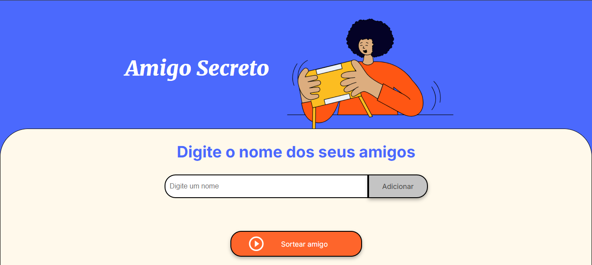
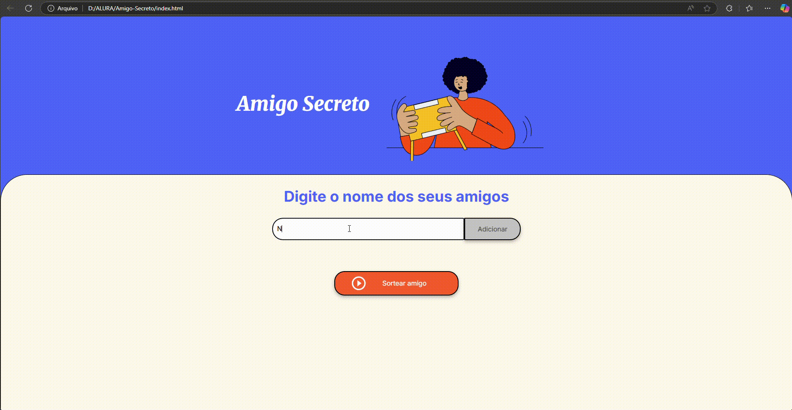

<!DOCTYPE html>
<html lang="pt-br">
<head>
    <meta charset="UTF-8">
    <meta name="viewport" content="width=device-width, initial-scale=1.0">
  
</head>
<body>
    <header>
        <h1>Jogo de Sorteio de Nomes</h1>
    </header>
    <main>
        <div>
              
              
                
        </div>
        <p>Este é um simples jogo desenvolvido com <strong>HTML</strong>, <strong>CSS</strong> e <strong>JavaScript</strong>, no qual o objetivo é digitar uma lista de nomes e, em seguida, o jogo sorteia aleatoriamente um dos nomes digitados.</p>
        <h3> 📚Tecnologias Utilizadas:</h3>
        <ul>
            <li><strong>HTML</strong>: Estruturação da página e criação dos campos de entrada e botões.</li>
            <li><strong>CSS</strong>: Estilização da página e layout para garantir uma boa experiência visual.</li>
            <li><strong>JavaScript</strong>: Lógica para capturar os nomes inseridos e realizar o sorteio aleatório.</li>
        </ul>
    </main>
</body>
</html>

## 🔨Funcionalidades

- **Adicionar Nomes**: O usuário pode adicionar nomes de amigos por meio de um campo de texto e um botão "Adicionar".
- **Validação de Entrada**: Caso o campo de texto esteja vazio, o sistema exibirá um alerta solicitando que o usuário insira um nome válido.
- **Visualizar Lista**: Os nomes inseridos pelo usuário aparecerão em uma lista visível na página, permitindo ao usuário verificar quais amigos foram adicionados.
- **Sorteio Aleatório**: Após adicionar os nomes, o usuário pode clicar no botão "Sortear Amigo", que selecionará aleatoriamente um nome da lista e o exibirá na tela como o "Amigo Secreto".



## 📱Como Usar

1. **Adicionar Nomes**: Digite o nome de um amigo no campo de texto e clique no botão "Adicionar". O nome será adicionado à lista visível na página.
2. **Ver a Lista**: Todos os nomes adicionados aparecerão em uma lista abaixo do campo de entrada.
3. **Sortear Amigo Secreto**: Após adicionar todos os amigos, clique no botão "Sortear Amigo" para selecionar aleatoriamente um nome da lista e revelar o "Amigo Secreto".



## 📲Instalação

Para executar este projeto em sua máquina local, siga os passos abaixo:

1. Clone este repositório:
   ```bash
   git clone https://github.com/NayaraCalixto/amigo-secreto.git

